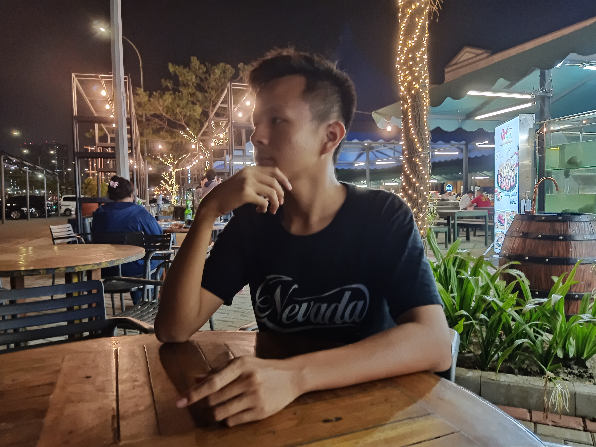

---
# Feel free to add content and custom Front Matter to this file.
# To modify the layout, see https://jekyllrb.com/docs/themes/#overriding-theme-defaults

layout: default
---

  

      
  

  

# Halo, saya Fernanda Ramadhan.
## Bukan seorang programmer ataupun seorang IT Profesional, tapi suka belajar, berkarya dan membuat sesuatu dengan pemrograman. Halaman ini adalah ruang bagi saya untuk berekspresi.
  

## Blog

  <ul>
    
      
      <li>
        <a href="{{ post.url }}">{{ post.title }}</a> - {{ post.date | date_to_long_string }}
      </li>
      
    
  </ul>

## Beberapa Project yang pernah saya kerjakan ...
  <ul>
      
        
        <li>
          <a href="{{ post.url }}">{{ post.title }}</a> - {{ post.date | date_to_long_string }}
        </li>
        
      
    </ul>

## Sajak
  <ul>
    
      
      <li>
        <a href="{{ post.url }}">{{ post.title }}</a>
      </li>
      
    
  </ul>
## Singkat Cerita
  <ul>
    
      
      <li>
        <a href="{{ post.url }}">{{ post.title }}</a> 
      </li>
      
    
  </ul>

